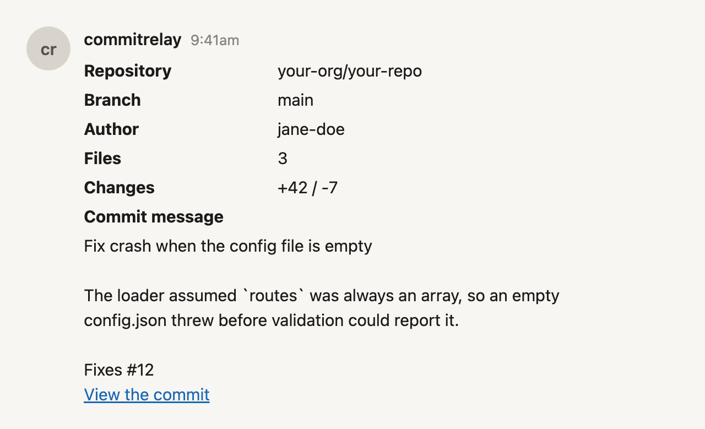

# commit-relay

Post every Git commit into a Basecamp Campfire chat, as a table.

[](https://github.com/AKMofficial/commit-relay/actions/workflows/ci.yml)
[](https://github.com/AKMofficial/commit-relay/releases)
[](./LICENSE)
[](https://github.com/AKMofficial/commit-relay/pkgs/container/commit-relay)
[](https://scorecard.dev/viewer/?uri=github.com/AKMofficial/commit-relay)

commit-relay receives GitHub `push` and `pull_request` webhooks and posts one Basecamp Campfire chat line per commit: repository, branch, author, file count, `+/-` line counts, and the full commit message, rendered as a small HTML table with one link to the commit on GitHub. Pull requests get the same table when one is opened, merged, closed, reopened, marked ready for review, or reviewed. It is a single stateless service you run yourself, on Cloudflare Workers or in a container.

It is for teams who already live in Campfire and want commits to show up there without opening GitHub.

It is deliberately not a general integration platform: no database, no persistent state, no cron or scheduled digests, no backfill, and no two-way sync, commits go one way, into one or more rooms.



## Why not the built-in integration or Zapier

- **Per-commit `+/-` line stats.** Each message carries `additions` / `deletions` for that commit, fetched from the GitHub REST API. Neither the built-in Campfire integration nor a generic automation step gives you the diff size at a glance.
- **Every branch, and it says which.** Commits on any branch are relayed by default and each table names the branch they landed on. Glob-matched branch and tag allowlists, globally or per repository, narrow that again when a busy `release/*` tree would drown the room.
- **Pull requests, not just commits.** Opened, merged, closed without merging, reopened, ready for review, and reviews. The line counts come in the webhook payload, so a pull request costs no extra API call.
- **No per-task cost.** Automation platforms bill per run, and a 20-commit push is 20 runs. On Cloudflare Workers there is no resident process at all: between pushes the service costs nothing.
- **Your infrastructure.** The webhook payload, the commit message, and the Basecamp chatbot key never leave a deployment you control, so no third party ever sees a private commit message.

## Try it locally, no accounts

No Basecamp account, no GitHub webhook, no deploy.

```bash
pnpm install
cp .dev.vars.example .dev.vars
```

Edit `.dev.vars` **before** starting `pnpm dev:workers`, because wrangler dev does not reload
`.dev.vars` after a change, so a running dev server keeps the old values until you restart it.

In `.dev.vars`: **clear `BASECAMP_LINES_URL`** (leave it empty), set
`BASECAMP_API_BASE=http://127.0.0.1:9999`, set `GITHUB_WEBHOOK_SECRET` to a real value
(`openssl rand -hex 32`), and **replace `BASECAMP_CHATBOT_KEY`** with any throwaway value of
at least 8 characters that is not the shipped placeholder (for example `local-mock-key`, since the
mock accepts any key). The other three discrete `BASECAMP_*` ids can stay as copied from the example.

Terminal 1:

```bash
node scripts/mock-basecamp.ts
```

Terminal 2:

```bash
pnpm dev:workers
```

Terminal 3:

```bash
GITHUB_WEBHOOK_SECRET=<the same value> pnpm send:fixture tests/fixtures/push.normal.json
```

The mock server prints the rendered HTML it was posted. Add `--html out.html` to `mock-basecamp.ts` to write it to a file and open it in a browser, that is exactly how the screenshot above is produced.

## Quickstart: Cloudflare Workers (primary)

[](https://deploy.workers.cloudflare.com/?url=https://github.com/AKMofficial/commit-relay)

The button clones this repository into your own account, shows one setup page, and provisions the resources the Wrangler config declares ([docs](https://developers.cloudflare.com/workers/platform/deploy-buttons/)). Its documented constraints:

- The source repository **must be public**.
- Only `github.com` and `gitlab.com` are supported hosts; self-hosted GitHub or GitLab is not.
- Queues **are** auto-provisioned, so a button user does not run `wrangler queues create`.
- Whether the referenced **dead-letter queue** is auto-created is **not documented** anywhere. Verify it exists after your first deploy, and create it by hand if it does not.

The manual path is three commands:

```bash
npx wrangler queues create commit-relay-commits
npx wrangler queues create commit-relay-dlq

npx wrangler secret put BASECAMP_LINES_URL      # the whole URL, key included: one secret, done
npx wrangler secret put GITHUB_WEBHOOK_SECRET
npx wrangler secret put GITHUB_TOKEN            # skip if every relayed repo is public

npx wrangler deploy
```

Behaviour knobs go in `wrangler.jsonc` `vars`, which is a committed file:

```jsonc
"vars": {
  "BRANCHES": "**",
  "LOG_LEVEL": "info"
}
```

**No Basecamp value ever goes in `wrangler.jsonc`.** The account, bucket, and chat ids are not credentials on their own, but together with the chatbot key they are the complete posting URL, and `wrangler.jsonc` is published with your fork. `vars` carries behaviour; `secret` carries identity.

## Quickstart: Node (fallback)

```bash
docker run -d --name commit-relay \
  -p 3000:3000 \
  --restart unless-stopped \
  --read-only --tmpfs /tmp \
  --memory 512m \
  --stop-timeout 30 \
  -e GITHUB_WEBHOOK_SECRET="$(openssl rand -hex 32)" \
  -e BASECAMP_ACCOUNT_ID=1234567 \
  -e BASECAMP_CHATBOT_KEY=your-chatbot-key \
  -e BASECAMP_BUCKET_ID=2345678 \
  -e BASECAMP_CHAT_ID=7654321 \
  -e GITHUB_TOKEN=<your-fine-grained-pat> \
  ghcr.io/akmofficial/commit-relay:0.1
```

`ACCOUNT_ID` is a URL-path-segment placeholder only; every environment variable takes the numeric literal.

On Railway, deploy the same image with `railway.json` in the repository: `DOCKERFILE` builder, `healthcheckPath: "/healthz"`, `restartPolicyType: "ON_FAILURE"`, `numReplicas: 1`, `sleepApplication: false`, and `drainingSeconds` above `SHUTDOWN_DRAIN_MS`. Set the same environment variables as Railway variables, and set `TRUSTED_PROXY_HOPS=1`.

**The Node path has weaker durability guarantees, at-most-once, an in-process queue, and exists for two reasons: Workers has no static egress IP, so it cannot reach a GitHub Enterprise Server behind an IP allowlist; and the dual typecheck is what keeps `src/core/` platform-pure.** It is not a co-equal target.

## Setup: the two things people get wrong

**Basecamp.** Open the Campfire, then **•••** → **Configure chatbots** → add a chatbot and copy the whole posting URL it shows you. It looks like this:

```
https://3.basecampapi.com/1234567/integrations/YOUR_KEY/buckets/2345678/chats/7654321/lines.json
                          ^^^^^^^              ^^^^^^^^         ^^^^^^^       ^^^^^^^
                          ACCOUNT_ID           CHATBOT_KEY      BUCKET_ID     CHAT_ID
```

Set `BASECAMP_LINES_URL` to that whole string. It is the preferred form: three of the four values are indistinguishable 7-digit numbers, swapping the bucket and chat ids produces a 404 that reads like "wrong project", and one URL is one secret instead of four values. The four discrete `BASECAMP_*` variables are equally supported if you prefer them.

**GitHub.** Repository **Settings** → **Webhooks** → **Add webhook**:

- **Payload URL**: your deployment plus `WEBHOOK_PATH`, e.g. `https://relay.example.com/webhook`.
- **Content type**: `application/json`. Form encoding signs different bytes and produces a 401 that looks exactly like a wrong secret.
- **Secret**: the same value as `GITHUB_WEBHOOK_SECRET`.
- **Events**: "Let me select individual events" → tick **Pushes**, **Pull requests**, and **Pull request reviews**.

## Configuration

Every variable below is in the zod schema in `src/config/schema.ts`, in `.env.example`, and in `.dev.vars.example`; CI asserts the three lists match. Boot fails closed and `GET /healthz` returns 500 naming **every** missing or invalid key at once, never a value.

| Variable | Required | Default | Description |
|---|---|---|---|
| `BASECAMP_LINES_URL` | one of the two forms | *(none)* | **Secret.** The whole chatbot posting URL. Wins over the four discrete values below |
| `BASECAMP_ACCOUNT_ID` | one of the two forms | *(none)* | The number immediately after the host in any Basecamp URL |
| `BASECAMP_CHATBOT_KEY` | one of the two forms | *(none)* | **Secret.** The token between `/integrations/` and `/buckets/`. Rotate by deleting the chatbot and creating a new one |
| `BASECAMP_BUCKET_ID` | one of the two forms | *(none)* | The number after `/buckets/` (a bucket is a project) |
| `BASECAMP_CHAT_ID` | one of the two forms | *(none)* | The number after `/chats/` (the Campfire) |
| `BASECAMP_API_BASE` | no | `https://3.basecampapi.com` | Override for tests and mocks |
| `BASECAMP_TIMEOUT_MS` | no | `10000` | Per-POST timeout |
| `BASECAMP_MIN_INTERVAL_MS` | no | `250` | Floor between posts. 250 ms is 4 req/s, a 20% margin under Basecamp's 50-per-10-seconds |
| `BASECAMP_MAX_SLEEP_MS` | no | `30000` | Clamp on any `Retry-After` or `x-ratelimit` sleep. Matches the 30 s `ctx.waitUntil` ceiling |
| `USER_AGENT` | no | derived from `package.json` | Sent to Basecamp and GitHub; both require one. Put a real contact address in it |
| `GITHUB_WEBHOOK_SECRET` | **yes** | *(none)* | **Secret.** The webhook's Secret field, minimum 32 characters. `openssl rand -hex 32` |
| `GITHUB_TOKEN` | no | *(none)* | **Secret.** Fine-grained PAT with Contents: read. Optional, but required in practice for private repos: unauthenticated requests get 404, not 403. Additional tokens are `GITHUB_TOKEN_<SUFFIX>`, referenced from a route's `githubTokenEnv` |
| `GITHUB_API_BASE` | no | `https://api.github.com` | GitHub Enterprise Server API base |
| `GITHUB_WEB_ORIGIN` | no | `https://github.com` | The **web** origin, not the API one. The sole allowlist every rendered `href` is checked against; never payload-derived |
| `GITHUB_CONCURRENCY` | no | `4` | Parallel stats lookups in the enricher's lookahead window |
| `GITHUB_TIMEOUT_MS` | no | `8000` | Per stats request |
| `GITHUB_STATS_MAX_BYTES` | no | `1048576` | Byte budget on a stats response; above it the read is aborted and the commit resolves to `stats: null` |
| `FETCH_LINE_STATS` | no | `auto` | `auto` (on iff a token resolves) / `on` / `off` |
| `REQUIRE_LINE_STATS` | no | `false` | Boot fails if `FETCH_LINE_STATS` would resolve to off |
| `ROUTES` | no | *(none)* | The routing document as one JSON line. Beats `CONFIG_FILE` |
| `CONFIG_FILE` | no | *(none)* | **Node only.** Path to the same JSON as a file. There is no implicit `./config.json` |
| `BRANCHES` | no | `**` | Global branch allowlist, comma-separated globs, case-sensitive. `**`, the default, means every branch |
| `PR_ACTIONS` | no | `opened,closed,reopened,ready_for_review` | Which pull request actions post a message, exact names from that list. Empty relays no pull request at all |
| `PR_REVIEWS` | no | `true` | Post a message when a review is submitted: approved or changes requested |
| `PR_SKIP_DRAFTS` | no | `true` | Suppress a draft pull request until it is marked ready for review |
| `TAGS` | no | *(empty)* | Tag allowlist, matched with `refs/tags/` stripped. **Empty means no tag push is ever relayed** |
| `REPO_ALLOWLIST` | no | *(empty)* | `owner/repo` globs, evaluated before routing, case-insensitive. Empty accepts any correctly-signed repo and warns once at boot |
| `SKIP_FORCED_PUSHES` | no | `false` | Left false, a forced push posts one rollup labelled as a force push. True posts nothing at all for it |
| `SKIP_MERGE_COMMITS` | no | `true` | Suppresses the merge commit itself; a merged PR **still posts every commit from the branch** |
| `SKIP_NON_DISTINCT` | no | `true` | Drops commits delivered with `distinct: false` |
| `IGNORE_AUTHORS` | no | *(empty)* | Globs matched against `sender.login`, `commit.author.username`, and `commit.author.email`, e.g. `dependabot[bot]` |
| `MAX_COMMITS_PER_PUSH` | no | `15` | Per-push cap on individually rendered commits; above it, one rollup. Set by Cloudflare's free-plan 50-subrequest ceiling, not by taste |
| `SUBREQUEST_BUDGET` | no | `50` | Workers only: outbound calls per invocation. Stats stop and posts defer before Cloudflare's `Too many subrequests` fires. Ignored on Node |
| `COMMIT_BODY_MAX_CHARS` | no | `2000` | Commit message clip, in Unicode code points |
| `CONTENT_MAX_BYTES` | no | `16384` | Ceiling on the assembled content string in UTF-8 bytes |
| `ENRICH_DEADLINE_MS` | no | `45000` | After this a pending enrichment is force-promoted with `stats: null`. Must be at least `GITHUB_TIMEOUT_MS * 3 + 8000` |
| `POST_RETRY_BUDGET_MS` | no | `20000` | Total 5xx retry wall-time per message |
| `RATELIMIT_WAIT_BUDGET_MS` | no | `60000` | Separate budget that 429 and `x-ratelimit` sleeps draw on |
| `MAX_QUEUE_DEPTH` | no | `500` | **Node only.** Push jobs held in the in-process FIFO |
| `MAX_QUEUE_BYTES` | no | `33554432` | **Node only.** The same bound counted in bytes |
| `DEDUP_MAX_ENTRIES` | no | `10000` | Bound on the delivery-id dedup LRU |
| `DEDUP_TTL_HOURS` | no | `72` | How long a delivery id is remembered. GitHub's manual redelivery window is 3 days |
| `DROP_ALERT_WINDOW_MS` | no | `300000` | Rolling window over which dropped jobs are counted, one alert per window |
| `MAX_BODY_BYTES` | no | `26214400` | Request body ceiling, just above GitHub's 25 MB payload cap |
| `RATE_LIMIT_PER_MINUTE` | no | `120` | Per-IP cap on the webhook path, applied before HMAC |
| `TRUSTED_PROXY_HOPS` | no | `0` | **Node only.** `X-Forwarded-For` entries to skip from the right. 0 for docker/VPS, 1 for Railway/Fly/Render, 2 with a CDN in front. The wrong value turns the rate limiter into a no-op |
| `WEBHOOK_PATH` | no | `/webhook` | Receiver path |
| `PORT` | no | `3000` | **Node only.** Injected by most PaaS platforms |
| `SHUTDOWN_DRAIN_MS` | no | `20000` | **Node only.** SIGTERM drain budget. Must be below the platform's own grace period |
| `LOG_LEVEL` | no | `info` | `trace` / `debug` / `info` / `warn` / `error` |
| `LOG_PAYLOADS` | no | `false` | Requires `LOG_LEVEL=trace` as well. Logs private-repo commit messages and file paths |
| `HEALTH_TOKEN` | no | *(unset, and `/health/detail` then 404s)* | **Secret.** Compared against the `X-Health-Token` header, minimum 16 characters |

### ROUTES

A single-room setup needs none of this: the four flat `BASECAMP_*` values (or the one URL) plus `BRANCHES` are a complete, supported configuration, and `ROUTES` ships documented and unused. Reach for it when different repositories must reach different rooms, or when two GitHub organizations need two tokens.

```jsonc
{
  "defaults": { "branches": ["main"] },
  "routes": [
    {
      "repo": "your-org/*",
      "branches": ["main", "release/*"],
      "target": { "accountId": "1234567", "bucketId": "2345678", "chatId": "7654321", "chatbotKeyEnv": "BASECAMP_CHATBOT_KEY" }
    }
  ],
  "fallthrough": "ignore"
}
```

A route may also carry `tags`, `githubTokenEnv` (named `GITHUB_TOKEN_<SUFFIX>`), `webhookSecretEnv` (named `GITHUB_WEBHOOK_SECRET_<SUFFIX>`), `githubApiBase`, `ignoreAuthors`, `maxCommitsPerPush`, and the three `skip*` booleans. Secrets are named, never inlined: `chatbotKeyEnv` names the variable holding the key. `fallthrough: "ignore"` drops a push that matches no route; `"defaults"` sends it to the defaults target.

### Branch and tag globs

Matching is segment-wise and full-string, `main` does not match `main-backup`, with no character classes, braces, or negation:

| Token | Matches |
|---|---|
| `*` | Zero or more characters **within one `/`-separated segment** |
| `?` | Exactly one character, not `/` |
| `**` | Zero or more whole segments, including none. `**` alone matches everything |

Branch and tag matching is **case-sensitive**, because git refs are; repository matching is **case-insensitive**, because GitHub repository names are. A tag is never matched against `BRANCHES`: `refs/tags/v0.1.0` is classified as tag `v0.1.0` and matched against `TAGS` only, and an empty `TAGS` relays no tag push at all.

## How it works, and its honest limits

- One `push` webhook in, one Basecamp chat line per commit out. On Workers the receiver verifies the HMAC and enqueues; a queue consumer renders and posts. On Node the same pipeline runs behind an in-process FIFO.
- **GitHub does not automatically redeliver a failed delivery**, and the manual **Redeliver** button expires after 3 days ([docs](https://docs.github.com/en/webhooks/testing-and-troubleshooting-webhooks/redelivering-webhooks)). A delivery has 10 seconds to reach a 2xx.
- The delivery contract, in full: *"At-most-once across process death on the Node target; at-least-once across queue redelivery on the Workers target; at-least-once across transport timeouts and 429 retries on both. Exactly-once is not offered."*
- `+/-` line counts cost **one REST call per commit** and need a `GITHUB_TOKEN` for private repos. Without one the **Changes** row reads `N/A`; the **Files** row still has a number, because it is derived from the payload at zero cost. A rename counts as **2** there (one `removed`, one `added`) where the REST `files[]` would have counted it as **1** `renamed`, so the number can differ from GitHub's UI by design.
- **Cross-push ordering is not guaranteed.** Commits within one push always arrive in order; two pushes racing each other may interleave.
- A pull request posts **one message** and makes **no GitHub API call**: `changed_files`, `additions` and `deletions` all arrive in the webhook payload. It is routed by its **base** branch, so `BRANCHES=main` means "pull requests targeting main".
- **The same change can reach the room twice** when a pull request is squash- or rebase-merged, because those rewrite SHAs and commit-relay keeps no database to recognise them. `SKIP_NON_DISTINCT` and `SKIP_MERGE_COMMITS`, both on by default, cover the ordinary merge; see [docs/configuration.md](docs/configuration.md) for exactly what is and is not suppressed.
- A push over `MAX_COMMITS_PER_PUSH`, a branch creation, and a force push each post **one rollup message** instead of per-commit tables: repository, branch, file count, authors, and the compare link, with **Changes** as `N/A`.
- **Every size number commit-relay enforces is a self-imposed legibility budget, not a platform limit.** Basecamp documents no content limit at all; a 16 KB HTML table is unusable in a chat scroll long before any server would object.

## Self-hosting notes

**Footprint.** On Workers there is no resident process: the working set is one push payload plus the rendered strings, roughly 50-200 KB for a typical 3-commit push. The Node container runs at **55-70 MB** steady state and around 90 MB peak under `--max-old-space-size=128 --max-semi-space-size=4`. The image is ~250 MB uncompressed, ~55 MB compressed, dominated by `node:24-alpine`; the application has two runtime dependencies and no transitive tree.

**Pin by digest in production.** The quickstart pins `:1` so patch releases arrive on their own; a production deployment should pin the digest instead:

```bash
docker pull ghcr.io/akmofficial/commit-relay@sha256:<digest>
```

Every release image ships a Sigstore-signed SLSA provenance attestation:

```bash
gh attestation verify oci://ghcr.io/akmofficial/commit-relay:0.1.0 --repo AKMofficial/commit-relay
```

**Reverse proxy and healthchecks.** Put TLS in front of the container, GitHub webhooks should never be sent over plaintext, and set `TRUSTED_PROXY_HOPS` to the number of proxies that append to `X-Forwarded-For`, counted from the right. `GET /healthz` returns 200 when configuration is valid and Basecamp is reachable, 500 on invalid configuration naming the missing keys, and 503 on a terminal Basecamp condition such as a rotated chatbot key. `GET /health/detail` needs `HEALTH_TOKEN` and 404s without it. On Railway the healthcheck is a **deploy gate only**, *"Railway does not monitor the healthcheck endpoint after the deployment has gone live"*, so point your own monitor at `/healthz` too.

**Leave Railway Serverless disabled.** *"The first request sent to a slept service may return a 502 Bad Gateway"* ([docs](https://docs.railway.com/reference/app-sleeping)). Against a 10-second GitHub timeout with no automatic redelivery, that is not a slow request, it is a silently lost push. Keep `sleepApplication: false` in `railway.json`, which overrides the dashboard, and raise `drainingSeconds` above `SHUTDOWN_DRAIN_MS`, Railway's default grace period is 0 seconds, so an in-process queue otherwise loses everything on every redeploy.

## Troubleshooting

Every row below ends the same way: GitHub's **Settings → Webhooks → Recent Deliveries → Redeliver** replays the exact payload against your fix, which is the fastest debug loop there is and the one most people do not know exists.

| Symptom | Cause | Fix |
|---|---|---|
| Every delivery is 401 and the secret looks right | The hook is set to `application/x-www-form-urlencoded`, so GitHub signs `payload=%7B...` | Change Content type to `application/json`, then Redeliver |
| 415 in the log | The same thing, detected explicitly | As above, then Redeliver |
| 202 on GitHub, nothing in Campfire, no error | A filter dropped it: most often the branch is not allowlisted. Every drop is an `info` log naming the reason, the branch, and every pattern tried | `wrangler tail \| grep push_skipped`, fix `BRANCHES`, then Redeliver |
| Basecamp returns 401 | Wrong, rotated, or deleted chatbot key. There is no key rotation in Basecamp | Recreate the chatbot, update `BASECAMP_CHATBOT_KEY` or `BASECAMP_LINES_URL`, then Redeliver |
| Basecamp returns 404 | Bucket and chat ids swapped, or wrong | Re-derive all four values from the chatbot URL in one go, then Redeliver |
| Basecamp returns 400 | Missing `User-Agent` | Set `USER_AGENT` to a name plus a contact URL or email, then Redeliver |
| Messages land in the wrong room | The four ids came from two different chatbot URLs, or a `ROUTES` target overrides the flat values | Take all four from one URL, check the matched route's `target`, then Redeliver |
| The `Changes` row is always `N/A` | No `GITHUB_TOKEN` resolved, the repo is private, or the stats call failed | Set a fine-grained PAT with Contents: read, or set `REQUIRE_LINE_STATS=true` to make boot refuse the silent version, then Redeliver |
| Duplicate messages | Queue redelivery after a consumer crash re-posts what already posted, or more than one Node replica is running | Expected on Workers: at-least-once. On Node, set `numReplicas: 1`, then Redeliver |
| `GET /healthz` → 500 with `{"status":"config_invalid","missing":[…]}` | Those keys are unset, empty, or whitespace-only | `wrangler secret put <NAME>`, or add them to `.env` / `.dev.vars`. The array names every problem at once, so one redeploy clears them all: then Redeliver |
| `Error: Too many subrequests.` | Workers Free, 50 external subrequests per invocation | Lower `MAX_COMMITS_PER_PUSH`, confirm `max_batch_size: 1`, or move to Paid, then Redeliver |
| `waitUntil() tasks did not complete within the allowed time…` | Running with no queue binding, over the 30 s degraded-mode budget | Create the queues and restore the `queues` block, then Redeliver |
| A rebase or `git push --force` posted nothing | `SKIP_FORCED_PUSHES` is on | Turn it off to get one rollup labelled as a force push instead, then Redeliver |

## FAQ

**Slack or Discord?** No. The renderer targets Basecamp's chatbot HTML subset and the whole project is one endpoint deep. Slack and Discord have good first-party GitHub apps.

**GitHub Enterprise Server?** Yes, on the Node target: set `GITHUB_API_BASE` and `GITHUB_WEB_ORIGIN` to your instance. Workers cannot do it if your GHES sits behind an IP allowlist, because Workers has no static egress IP.

**Private repos?** Yes. Set `GITHUB_TOKEN` to a fine-grained PAT with Contents: read, or the **Changes** row degrades to `N/A`, an unauthenticated stats call against a private repo returns 404, not 403.

**Monorepos?** They work, but there is no path filter: every commit on an allowlisted branch posts. Narrow with `BRANCHES` and `IGNORE_AUTHORS`.

**PR and issue events?** No. Push only. Adding event types would mean a second renderer and a second set of failure modes for a different product.

**What does it cost to run?** On Workers Free, effectively nothing: duration is not charged, there is no resident process, and Queues are included at 10,000 operations/day. A container is the price of the smallest instance your platform sells, 24/7, whether or not anyone pushes.

**Why one message per commit instead of a digest?** A digest needs state and a schedule, and both are explicitly out of scope. One commit, one line, is also what makes the room searchable by SHA.

**What happens on a 500-commit push?** Nothing is rendered per commit. You get one rollup message, repository, branch, file count, distinct authors, and the compare link, because 500 commits is 1,000 subrequests and an unreadable room either way.

## Documentation

- [docs/cloudflare-setup.md](./docs/cloudflare-setup.md): deploy to Cloudflare Workers.
- [docs/node-setup.md](./docs/node-setup.md): run the container on Node.
- [docs/basecamp-setup.md](./docs/basecamp-setup.md): create the Campfire chatbot and get its key.
- [docs/configuration.md](./docs/configuration.md): every setting, its default, and its precedence.
- [docs/basecamp-compat.md](./docs/basecamp-compat.md): what HTML the Campfire renderer survives.
- [CHANGELOG.md](./CHANGELOG.md): release history.

## Contributing · Security · License

- [CONTRIBUTING.md](./CONTRIBUTING.md): how to run the tests and what CI enforces.
- [docs/INVARIANTS.md](./docs/INVARIANTS.md): the five source rules CI greps for, and why each exists.
- [SECURITY.md](./SECURITY.md): supported versions and how to report a vulnerability privately.
- [LICENSE](./LICENSE): MIT.

## Trademark

Not affiliated with, endorsed by, or sponsored by 37signals, LLC. Basecamp® and Campfire® are trademarks of 37signals, LLC. This project is an independent, unofficial integration.
